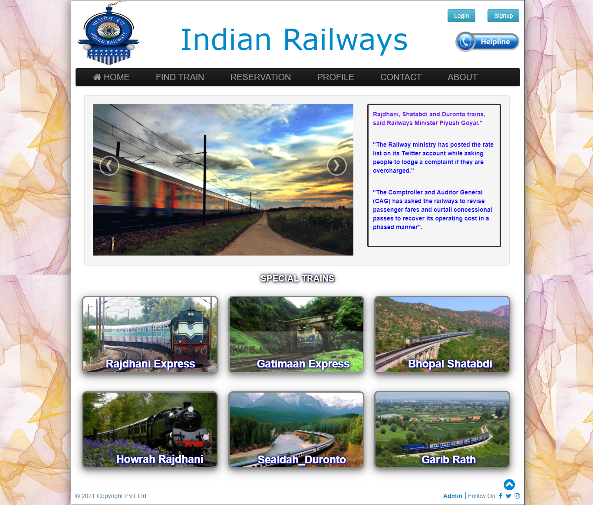
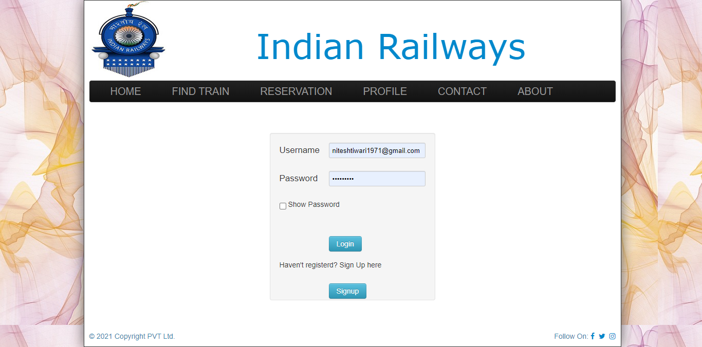
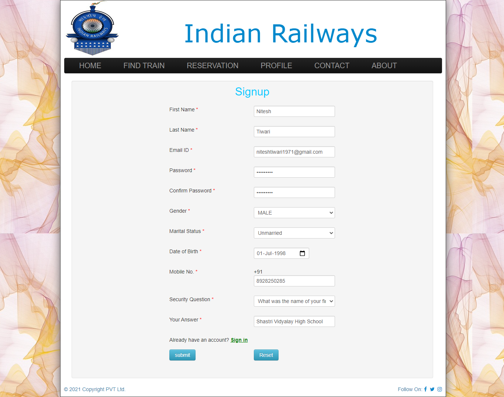
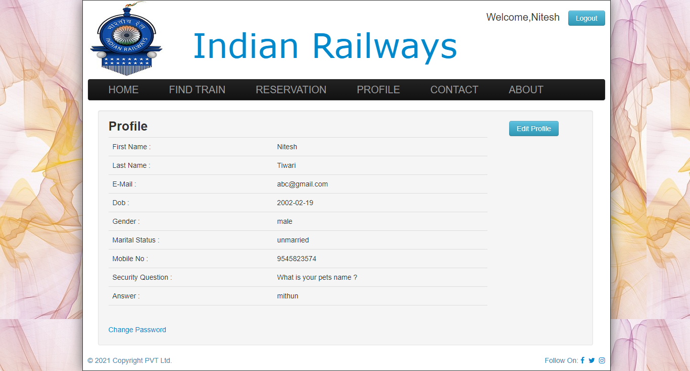
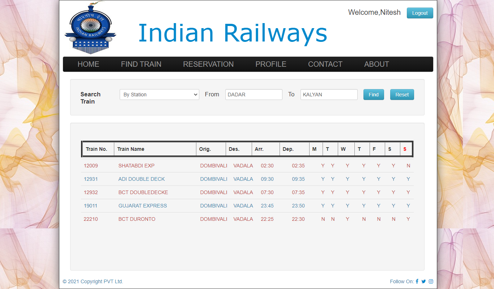
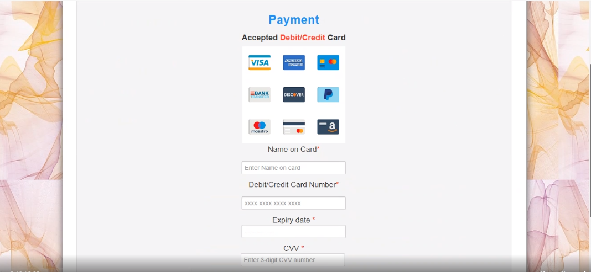
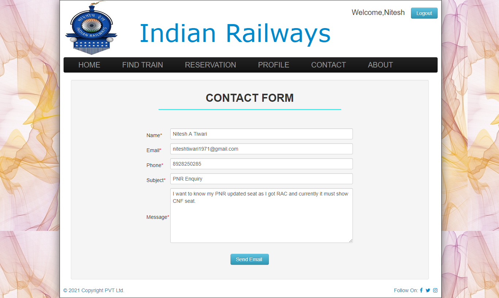
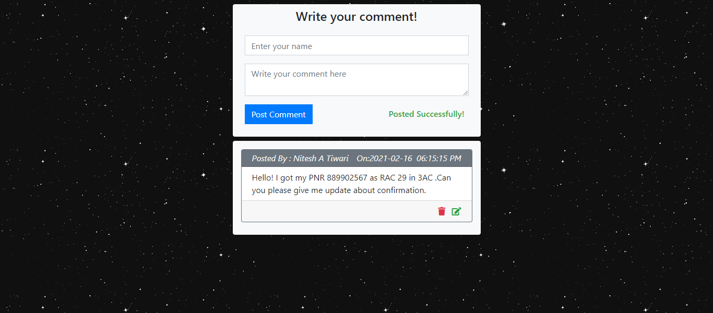
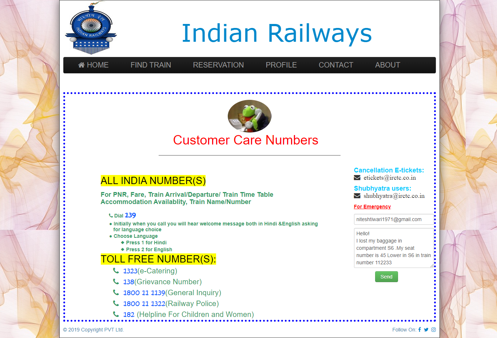

# Railway-Reservation-System
A web portal which helps Passengers to book tickets online from anywhere.The name of the web portal is Indian Railways.There are two types of users are involved in this ,the first one is Passenger and the second one is Admin.In this portal there are various long ditance and short distance trains are listed . Passengers can search trains with the help of source and destination or with name of train or with the number of the train.If passenger is new for the system then he/she must signup the details then login with credentials booking of tickets can be done after that payment gateway is available then make a payment and take your ticket(s).Safety of the passengers is the primary goal of this system ,for this there is Contact Us page is available in which railway urgent number and contact details are given ,passenger cam mail us also we will resolve their issues within hour of time .If passengers are satisfied with our services or want to suggest their views then there is Feedback form is available in which great suggestion of passengers are priortised.    

## To run the project follow these simple steps:  
### Step 1: Clone or Download the rar file from the repository
### Step 2: Copy the files in to htdocs for xampp server and in www for wamp server
### Step 3: Create 5 database files in the phpmyadmin namely admin.sql, booking.sql, interlist.sql, seats_availability.sql,train_list.sql and users.sql .
### Step 4: After creating the files you need to import the databases from the database folder.
### Step 5: After importing the database the system is ready to use just you need the open the home page of the system which is index.php 
### Step 6: Passenger(s) needs to login by clicking the login button and  if new to the system then signup the details.
### Step 7: After login passenger(s) needs to search the trains according to requirement and book the tickets then do payment and download ticket. 
### Step 8: For any issue fill contact form and if want to suggest fill the chat form we will improve in short interval of time.
 

### Home page of System

### Login Form

### Sign up Form

### Details List

### Find Trains and Book Ticket

### Make Payment

### Contact From 

### Feed back Form

### Customer Care 

 

